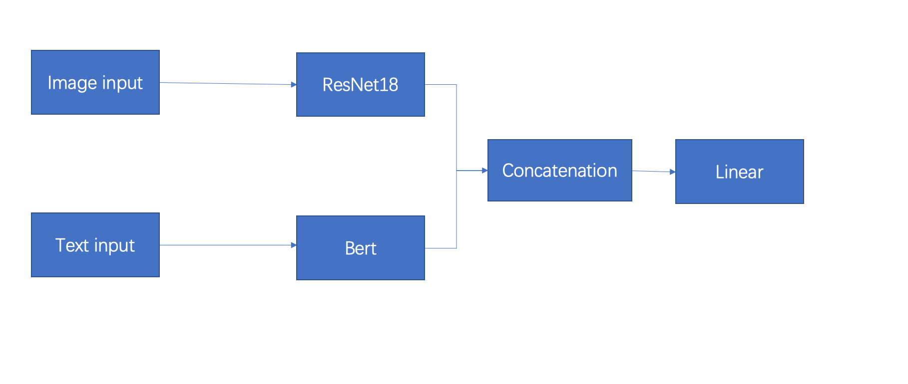

# MultiModalSentimentAnalysis

Source code for Experiment 5, multi-modal sentiment analysis.

## Dependency
* python 3.8.5+
* pytorch 1.13.0+
* ...

Dependency details can be found in [requirements.txt](requirements.txt).


## File Structure
```
.
├── dataset
│   ├── data
│   │   ├── 1.jpg
│   │   ├── 1.txt
│   │   ├── 2.jpg
│   │   ├── 2.txt
│   │   ├── 3.jpg
│   │   ├── 3.txt
│   │   ├── 4.jpg
│   │   ├── 4.txt
│   │   ├── ...
│   ├── dataloader
│   │   ├── test_dataloader.pth
│   │   ├── train_dataloader.pth
│   │   └── val_dataloader.pth
│   ├── test_without_label.txt
│   ├── test_with_pred_label.txt
│   └── train.txt
├── images
│   └── framework.jpg
├── models
│   ├── model_1.pth
│   ├── model_2.pth
│   ├── model_3.pth
│   ├── model_4.pth
│   ├── model_5.pth
│   ├── model_6.pth
│   ├── model_7.pth
│   ├── model_8.pth
│   ├── model_9.pth
│   ├── model_10.pth
│   └── model_best.pth
├── README.md
├── requirements.txt
└── src
    ├── __init__.py
    ├── model.py
    ├── process.py
    ├── test.py
    ├── text_model.py
    ├── train.py
    └── vision_model.py
```


## Quick Start

### 1. Process Data into Dataloader
```
python src/process.py --batch_size BATCH_SIZE --num_workers NUM_WORKERS
```

description:
```
BATCH_SIZE: batch size of dataloader, default 64
NUM_WORKERS: number of workers of dataloader, default 4
```
this will generate three files in `dataset/dataloader`:
```
train_dataloader.pth
val_dataloader.pth
test_dataloader.pth
```


### 2. Train Model
```
python src/train.py --epochs EPOCHS --lr LR
```

description:
```
EPOCHS: number of epochs to train, default 10
LR: learning rate, default 1e-4
```

this will use train and val dataloader to train the model and generate many model files in `models` for each epoch and the best model:
```
model_1.pth
model_2.pth
model_3.pth
...
mode_best.pth
```

### 3. Test Model
```
python src/test.py
```

this will use the best model `model_best.pth` to test the test dataset and generate a file `test_with_pred_label.txt` in folder `dataset`.


## Reference
1. huggingface repo: https://huggingface.co/transformers/model_doc/bert.html
2. resnet paper: https://arxiv.org/abs/1512.03385
3. transformer paper: https://arxiv.org/abs/1706.03762
4. bert paper: https://arxiv.org/abs/1810.04805
5. torch vision repo: https://pytorch.org/vision/stable/models.html

thanks for their great work!